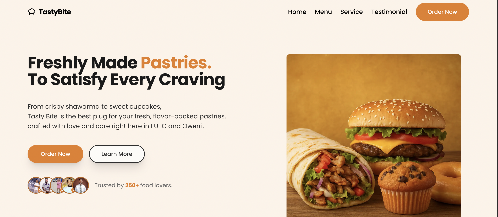

# 🥮🍴TastyBite Landing Page

A high-converting, responsive landing page built for TastyBite, a local food brand, to support their digital ad campaign and drive online orders.

## 📖 Project Overview

The TastyBite landing page was designed to capture the attention of ad traffic and quickly convert visitors into paying customers. It uses a clean layout, appetizing visuals, and persuasive copy to highlight the brand’s offerings and unique value.

## 🎯 Objectives

- Convert ad clicks into actual food orders.

- Showcase TastyBite’s popular meals with appealing visuals.

- Communicate the brand story and trustworthiness.

- Offer clear calls to action (CTA) for quick customer engagement.

## ✨ Key Features

- Hero Section – Eye-catching headline, tagline, and order button.

- About Section – Brief brand introduction.

- Menu Highlights – Display of popular dishes with descriptions.

- Why Choose Us – Core benefits: fresh ingredients, fast delivery, affordable pricing.

- Testimonials – Customer feedback to build trust.

- Promotional Offer – Limited-time campaign deal for first-time buyers.

- Contact & CTA – Multiple touchpoints (form, phone, WhatsApp link).

- Fully Responsive – Optimized across mobile, tablet, and desktop.

## 🛠️ Tech Stack

- Frontend: HTML, Tailwind CSS, JavaScript, React.

- Deployment: [vercel]

### 🚀 Live Demo

[🔗 View the Landing Page]()

## 📈 Future Enhancements

- Integrate analytics for conversion tracking.

- Add A/B testing for CTA placements and button variations.

- Expand menu section with categories and filters.

- Include newsletter sign-up for remarketing.

### 👨‍💻 Author

Designed & developed with ❤️ by [Divine Ugorji](https://x.com/Divine__Ugorji)
